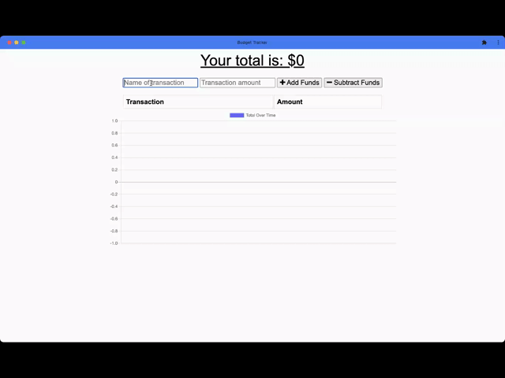
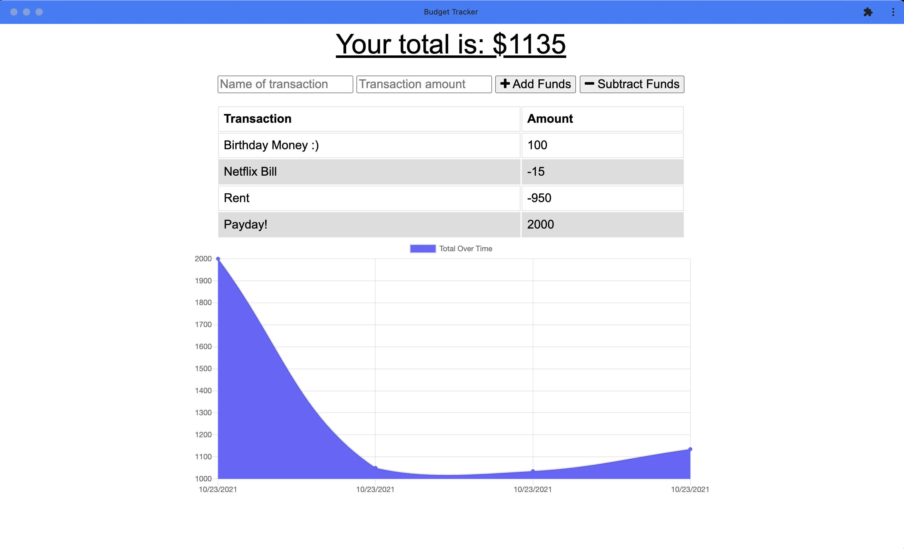

# Budget Buddy

## About

This is a Progressive Web Application that allows users to track their income and expenses. OUr finances are too important to hinge on having a good internet connection, this app is optimized to work with little or no service to the internet.

## Built with

  

## Links:

- [Deployment](https://budget-buddy-dz.herokuapp.com/)
- [GitHub](https://github.com/dzamanillo/budget-buddy)

## Contribution

Daniel Zamanillo

- [GitHub Profile](https://github.com/dzamanillo)
- [LinkedIn](https://www.linkedin.com/in/dzamanillo/)
- [Portfolio](https://dzamanillo.github.io/)
